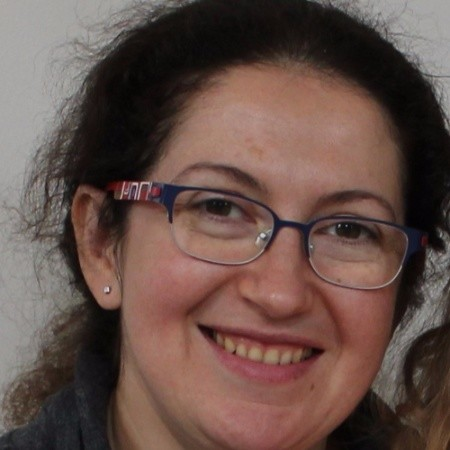
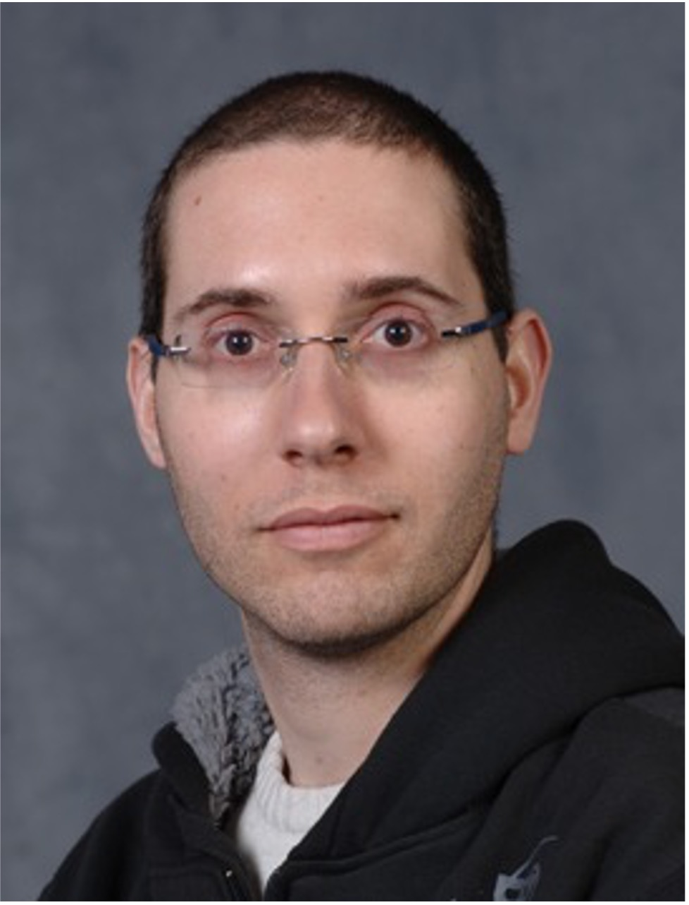

## Who Are We

We are Regina Ring and Yehuda Dinaii. Our journey into peroxisome biology began
with a personal discovery: our daughters' sensorineural hearing loss is caused
by the missense mutation **PEX26-F51L**. This finding drove us to investigate
how this mutation disrupts peroxisome biogenesis and ultimately leads to
sensorineural hearing loss.

## Regina Ring

```{=html}
<div style="display: flex; align-items: flex-start; gap: 1.5rem; margin-bottom: 1.5rem;">
  
  <div>
    <p>Regina holds an MSc in Computer Science from <a href="https://english.tau.ac.il">Tel Aviv
    University</a> and a BSc in Information Systems from the
    <a href="https://www.technion.ac.il/en/">Technion — Israel Institute of
    Technology</a>. She works as a Staff Software Engineer and contributes to
    the computational and infrastructural aspects of this research.</p>
    <p>📧 <a href="mailto:regina.ring@gmail.com">regina.ring@gmail.com</a></p>
  </div>
</div>
```

## Dr. Yehuda Dinaii

```{=html}
<div style="display: flex; align-items: flex-start; gap: 1.5rem; margin-bottom: 1.5rem;">
  
  <div>
    <p>Yehuda holds a PhD in Physics from the <a href="https://www.weizmann.ac.il/physics/">Weizmann Institute of
    Science</a>, where his research focused on theoretical condensed matter physics.
    He subsequently completed a two-year postdoc at the
    <a href="https://physics.osu.edu">Ohio State University</a>. In recent
    years his research direction has shifted toward structural and computational
    biology, motivated by the search for a deeper understanding of the PEX26-F51L
    mutation and its consequences.</p>
    <p>He is an Adjunct Lecturer at <a href="https://www.afeka.ac.il/en/">Afeka Academic College of
    Engineering</a> and at <a href="https://www.achva.ac.il/en/">Achva Academic
    College</a>, and his current research focuses on structural and computational
    modeling of the PEX1/PEX6/PEX26 AAA-ATPase complex.</p>
    <p>📧 <a href="mailto:yehuda.dinaii@gmail.com">yehuda.dinaii@gmail.com</a></p>
  </div>
</div>
```
