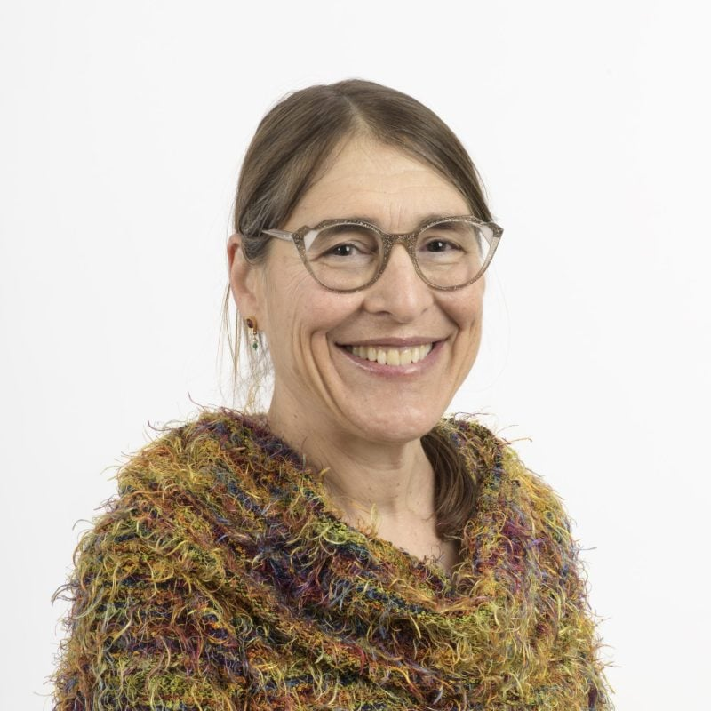

We are grateful to collaborate with leading research groups specializing in peroxisome
biology and genetic hearing loss.
```{=html}
<div style="display: flex; flex-wrap: wrap; justify-content: center; gap: 3rem; margin-bottom: 1.5rem;">
  <div style="display: flex; flex-direction: column; align-items: center; text-align: center; gap: 0.75rem;">
    
    <div>
      <strong>Dr. Einat Zalckvar</strong><br>
      <a href="https://www.zalckvarlab.com" target="_blank">Zalckvar Lab</a>
    </div>
    
  </div>
  <div style="display: flex; flex-direction: column; align-items: center; text-align: center; gap: 0.75rem;">
    
    <div>
      <strong>Dr. Joshua Manor</strong><br>
      <a href="https://www.sheba.co.il/doctors/yehoshua-manor" target="_blank">Sheba Medical Center Profile</a>
    </div>
    
  </div>
  <div style="display: flex; flex-direction: column; align-items: center; text-align: center; gap: 0.75rem;">
    
    <div>
      <strong>Prof. Nancy Braverman</strong><br>
      <a href="https://bravermanlab.wixsite.com/bravermanlab" target="_blank">Braverman Lab</a>
    </div>
    
    <div style="font-size: 0.9rem; max-width: 220px;">We take part in the Longitudinal Natural History Study of Patients With Peroxisome Biogenesis Disorders (PBD).</div>
  </div>
</div>
```
